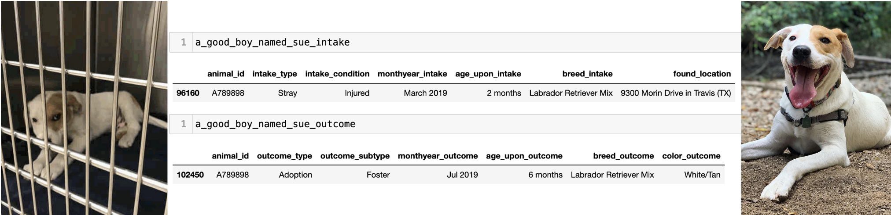

# Austin Animal Center Outcomes
## Which dogs will be adopted?

### Project Description

This project uses machine learning on data from Austin Animal Center (AAC) in an attempt to predict which dogs will be adopted and which will be transferred. 

### Project Goals

With a reliable and accurate prediction model, Austin Animal Center could better understand how to focus resources on marketing dogs for adoption as well as finding and coordinating transfer partners. This ultimately could lead to more efficient use of city resources and better outcomes for the dogs that find themselves in the city shelter. 

### Initial Questions

- How does the breed of the dog affect it's adoption outcome?

- How does the color of the dog affect it's adoption outcome?

- How does the age of the dog affect it's adoption outcome?

- How does the condition of the dog affect it's adoption outcome?

### Data Dictionary

This data was obtained from the City of Austin's open data portal at data.austintexas.gov. The data is published by the city's Animal Services department and updated on an hourly basis. The data available for this analysis represents all animals taken into the shelter from 10/01/2013 - 03/04/2022.

AAC publishes two separate dataset: "Intakes" and "Outcomes". These datasets were combined to perform this analysis.

From AAC: 
        
        "Intakes represent the status of animals as they arrive at the Animal Center. All animals receive a unique Animal ID during intake."

        "Outcomes represent the status of animals as they leave the Animal Center... Annually over 90% of animals entering the center, are adopted, transferred to rescue or returned to their owners. The Outcomes data set reflects that Austin, TX. is the largest "No Kill" city in the country.

(Note: no additional feature descriptions were included in the data source. Descriptions below are based on my own interpretation of the data.)

### Original Features 
(available from the original dataset with minimal feature engineering)

| Feature | Description |
| ------- | ----------- |
| outcome_type | (target) The method by which the animal left the shelter. Includes, among others, 'Adoption', 'Transfer', 'Return to Owner'. |
| animal_id | a unique identifier for each animal
| intake_type | The method by which the animal arrived at the shelter. Includes, among others, 'Stray', 'Owner Surrender', 'Abandoned' |
| intake_condition | The animal's health condition at the time of intake. Includes, among others, 'Normal', 'Injured', 'Sick', 'Aged' |
| month_intake | The month the animal arrived at the shelter. (Derived from 'datetime_intake') |
| fixed | Whether the animal had been spayed or neutered at the time of intake. (derived from 'sex_upon_intake') |
| sex | The sex of the animal (derived from 'sex_upon_intake')
| age_intake | The estimated age of the animal (in days) at the time of intake. (derived from 'Age upon Intake')
| found_location | The location from which the animal originated before being brought into the shelter. Includes cross streets when available. Sometimes only represents a city or county. Also 'Outside Jurisdiction' which likely represents locations outside Travis County, TX. 

### Engineered Features
(features derived from the original dataset using feature engineering techniques in pandas)
| Feature | Description |
| ------- | ----------- |
| breed_mixed | Whether the animal is a mixed breed (True) or purebred (False). (derived from 'Breed') |
| breed_1 | The primary breed of the animal. The first breed listed in the case of multiple breeds contained in the original 'Breed' column. |
| color_1 | The primary color of the animal. The first color listed in the case of multiple colors contained in the original 'Color' column. |
| n_previous_stays | The number of previous times this animal has been brought to the shelter. Derived from duplicate animal id's with separate datetime_intake entries in the original data. |
| stay_id | a unique identifer for each time a particular animal was brought into the shelter. Derived from 'animal_id' and 'n_previous_stays' |
| found_in_austin | Whether the animals found location was within Austin city limits. derived from 'found_location' |
| found_in_travis | Whether the animal was found in a location that is outside city limits but within Travis County. derived from 'found_location' |
| found_other | Whether the animal was found inside the city limits of a city other than Austin. derived from 'found_location' |
| found_outside_jurisdiction | Whether the animal was found outside AAC's jurisdiction. derived from 'found_location |
| is_pitbull | Whether the animal's primary breed is of a pit bull-type. derived from 'breed_1' |
| is_black | Whether the animal's primary color is black. derived from 'color_1' |
| breed_1_reduced | keeps intact the unique values for the 10 most common primary breeds, but bins together the remaining primary breeds into one category 'Other. derived from breed_1. |
| akc_breed_group | Represents the breed group to which the animal's primary breed belongs, as defined by the American Kennel Club. Derived from 'breed_1'. Source: https://www.akc.org/public-education/resources/general-tips-information/dog-breeds-sorted-groups/ |

### Steps to reproduce
1. The updated datasets can be exported as csv's at the following url's:
 - intakes: https://data.austintexas.gov/Health-and-Community-Services/Austin-Animal-Center-Intakes/wter-evkm
 - outcomes: https://data.austintexas.gov/Health-and-Community-Services/Austin-Animal-Center-Outcomes/9t4d-g238
 The versions used to create this analysis are included in this repository. 
2. Clone my repository (including the prepare.py, explore.py, and model.py)
3. Libraries used are pandas, matplotlib, seaborn, numpy, sklearn.

### Project Plan
1. Acquisition
- I acquired the data from the url's provided above and saved the datasets as .csv's to the working directory, then brought those .csv's into jupyter notebooks as pandas dataframes.
2. Preparation
- I cleaned and prepped the data by creating a function that:
    - renamed columns for convenience and legibility
    - dropped outcomes that didn't have a corresponding intake, and vis-versa
    - converted the datetime columns to pandas datetime types
    - added information about how many times the animal had been seen previously at the shelter
    - added a unique identifier for each time the animal had been seen at the shelter (stay_id)
    - joined the intakes and outcomes dataframes into one dataframe using the 'stay_id' identifier
    - dropped variables (except for outcome type) from the original 'outcomes' dataframe, since - by definition - they cannot be drivers of the outcome type. 
    - extracted the month from the datetime_intake column to represent the time of year the animal was brought into the shelter
    - split the sex_upon_intake column into fixed = True/False and sex = male/female, then dropped the original sex_upon_intake column
    - split the original breed column into 'breed_mixed', 'breed_1, and - if there were multiple breeds listed, 'breed_2' and 'breed_3', then dropped the original breed column
    - split the color description into multiple columns (color_1, color_2, color_3) when there was more than one color listed, then drop the original color column
    - convert the age column from a string into pandas timedelta (number of days)
    - create a boolean column 'found_in_austin' based on whether the string value for found_location includes 'Austin (TX)' 
    - create a boolean column 'found_in_travis' based on whether the string value for found_location includes 'Travis (TX)'
    - create a boolean column 'found_outside_jurisdiction' based on whether found location string value includes 'Outside Jurisdiction'
    - create a boolean column 'is_pitbull' based on whether 'breed_1' includes 'Pit Bull'
    - create a boolean column 'is_black' based on whether 'color_1' includes 'Black'
    - create a column 'akc_breed_group' that uses a dictionary to map each unique value found in the breed_1 column to that breed's group as defined by the American Kennel Club
    - drops columns not used for modeling in this analysis
    - filters rows to focus on only the most common outcome types: 'Adoption' and 'Transfer'
- Then used an additional function to filter the dataset for only the dogs (using animal_type == 'Dog')
- Missing values: There were no missing values in the original dataset, though my feature engineering process did create some columns that contained significant numbers of missing values. These columns were ultimately dropped and not used in this analysis. 
3. Exploration
- Split the data into train, validate, and test samples
- Conducted an initial exploration of the train data using some cursory visualization techniques to look at the distributions among various categorical variables, as well as the interaction of those categorical variables with the target. 
- Then explored further using visualization and statistical testing to answer the initial questions posed above. 
4. Modeling
- One-hot encoded categorical variables and scaled quantitative variables usinga Min-Max Scaler. 
- Then used Recursive Feature Elimination (RFE) to create Random Forest, Decision Tree, and Logistic Regression classifiers, using varying numbers of features and varying values for the appropriate hyperparameters for each algorithm.
- A total of **264 unique models** were created. 
5. Evaluation
- I then chose the model which performed with the highest accuracy on unseen data (the validate set) with the fewest number of features (11), and tested it's performance on the test set.

### Model Performance

The top performing model was a Random Forest model using a combination of 11 features (listed below), with a max-depth of 10. It performed with 70.6% accuracy on the test sample, which is a 1.8 point improvement over the baseline accuracy of 68.8%. This is only a modest increase, but shows there is some predictive power in the available data and encourages further exploration and analysis. 

### Key Findings

The following features were automatically selected by the RFE algorithms as the most important features in our selected model:
- whether or not the dog's spayed/neutered status was unknown
- whether the breed was mixed
- whether the intake type was a Public Assist
- whether the intake condition was Normal
- whether the intake condition was Sick
- whether the intake month was September
- whether the dog's sex was unknown
- whether the dog's primary breed was contained in the top 10 most common breeds
- whether the dog was in the Toy breed group
- whether the dog was found inside Austin city limits
- the age of the dog

Some additional exploration could tell us whether these factors increased or decreased the odds of the dog's being adopted. 

### Recommendations/Next Steps

Since I did not find significant predictive capability in my analysis, I don't have any specific recommendations for AAC at this time. However, there is a lot of interesting potential in this dataset. Some things I would like to do in the future include: 

1. Start by predicting whether a dog would be returned to it's owner, using Outcome Type == 'Return to Owner' as a target. From there, we could do some additional analysis to predict which dogs would be adopted. This might be a more useful prediction. 

2. Acquiring some domain knowledge about which animals are chosen for transfer and why could steer future analysis in more useful directions. I'd like to send an email inquiry to AAC officials to learn more about their processes. 

3. There is much more granular data available about the location where the animal was found that was not used in this analysis. I would like to use the Google Maps API to obtain more precise location info, then create additional features for modeling using zip codes, neighborhoods, or clustering algorithms. I suspect location information would prove valuable for predicting whether a dog would be returned to it's owner. 

4. Additional breed groupings could also prove useful for predictions. I would like to engineer additional features using varying categorizations such as whether the dog is considered to be:
    -  family friendly
    -   intelligent
    -   loyal
    -   etc
    
    The AKC maintains some lists like this that could be used to match individual breeds to a category. 

5. I would lso like to create more robust and interesting visualizations that would appeal to a public audience. Some of these might include: 
    - heat map of found_location
    - information about which breeds/breed categories are most common
    - which breeds/breed categories are adopted most frequently
    - which colors/color categories are most common/adopted most frequently
    - etc.

